# v0 UI integration screenshots

Reference: `SRI7979/desmo-3f`, branch `v0/refine-button-weights`, commit `5a54709`.

Captured at 1242×892 (desktop) and 390×844 (mobile). The first set compares the source and destination in the same empty-workspace state, in both themes.

| Viewport | Theme | Source | Destination |
| --- | --- | --- | --- |
| 1242×892 | Light | 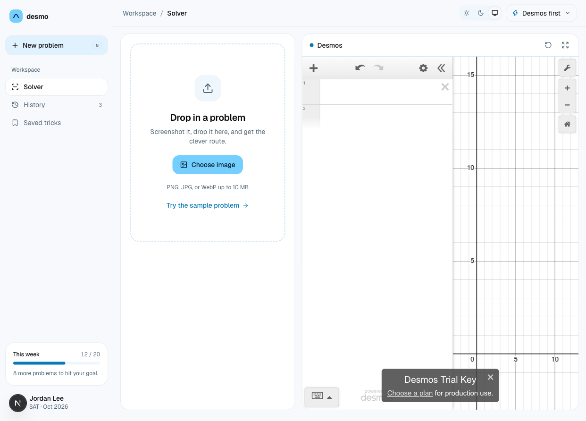 | 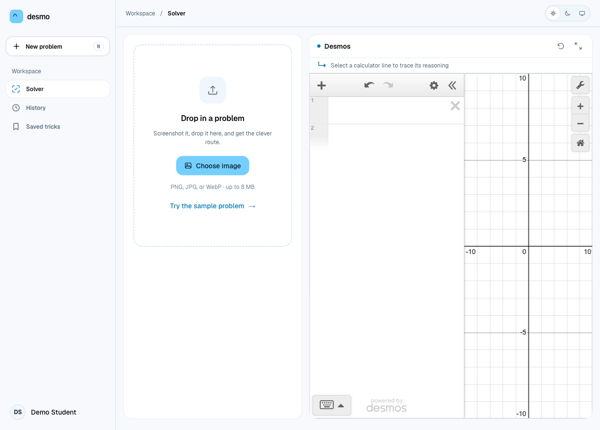 |
| 1242×892 | Dark | 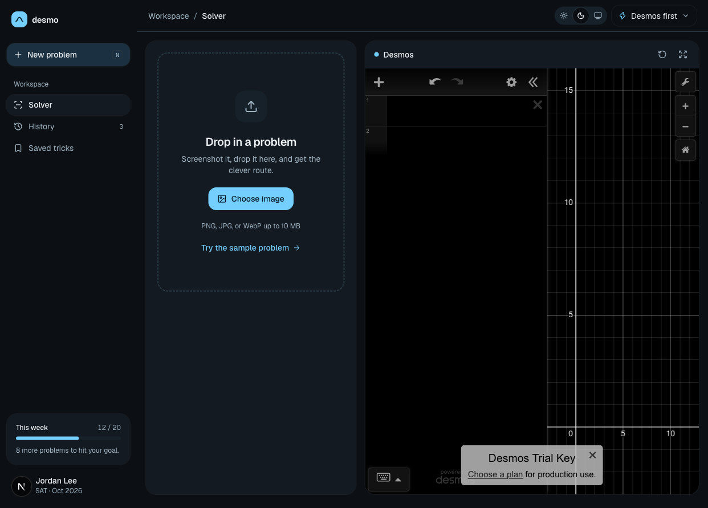 | 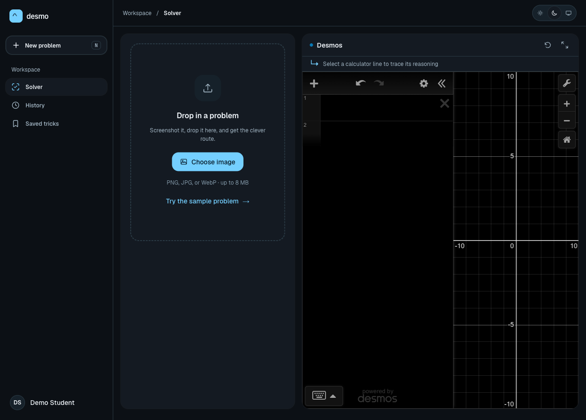 |
| 390×844 | Light | 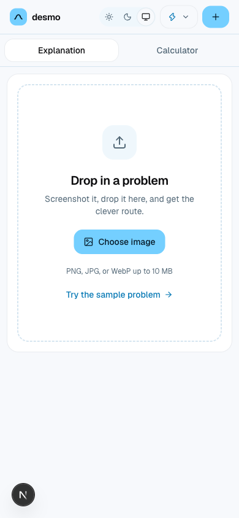 | 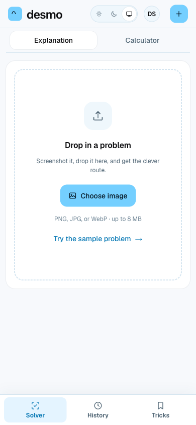 |
| 390×844 | Dark | 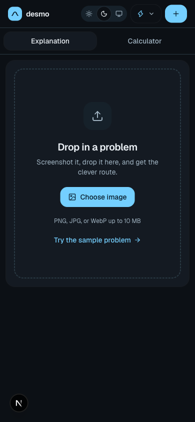 | 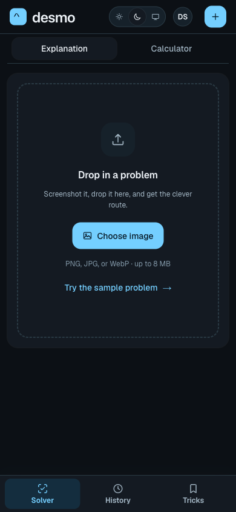 |

The seeded solved example in the source is a prototype. Destination solved-state screenshots use the real explanation, route selector, calculator, and account components with a temporary local fixture; no model request was made, and the fixture route was removed before the production build. The fixture uses a short quadratic so the answer, method stats, calculator rows, and tracing affordances fit in the captures.

| Viewport/state | Source prototype | Destination components |
| --- | --- | --- |
| Desktop, light, solved | 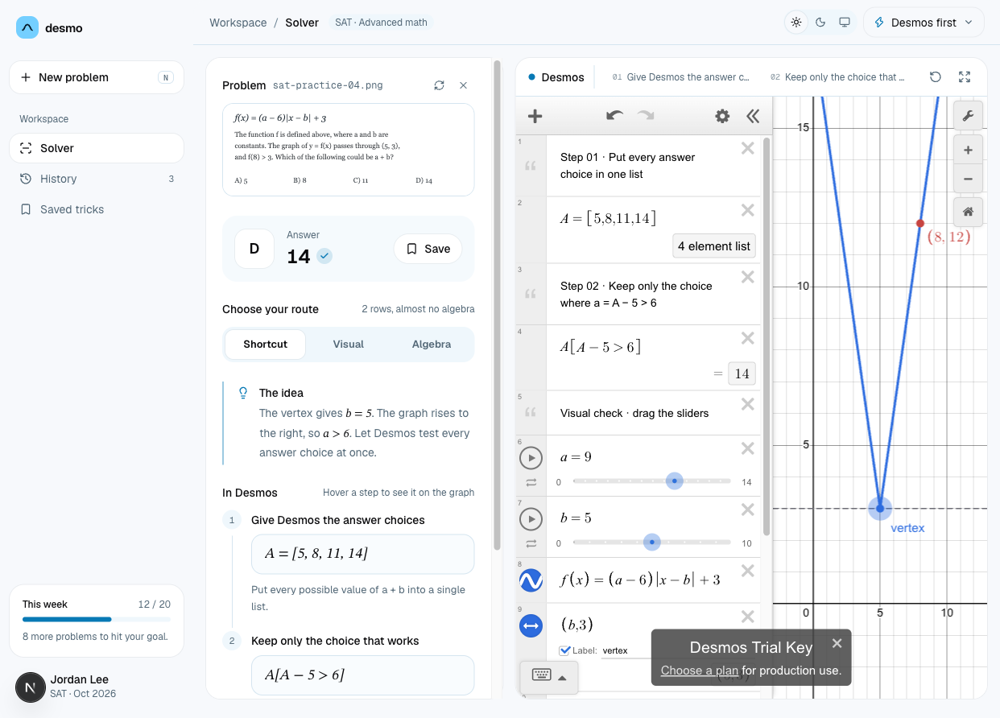 | 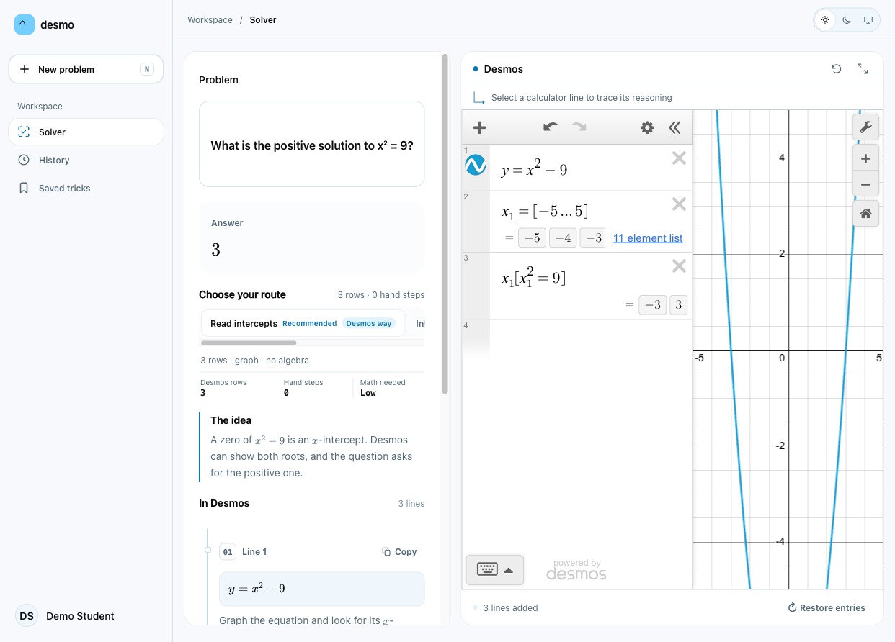 |
| Desktop, dark, solved | 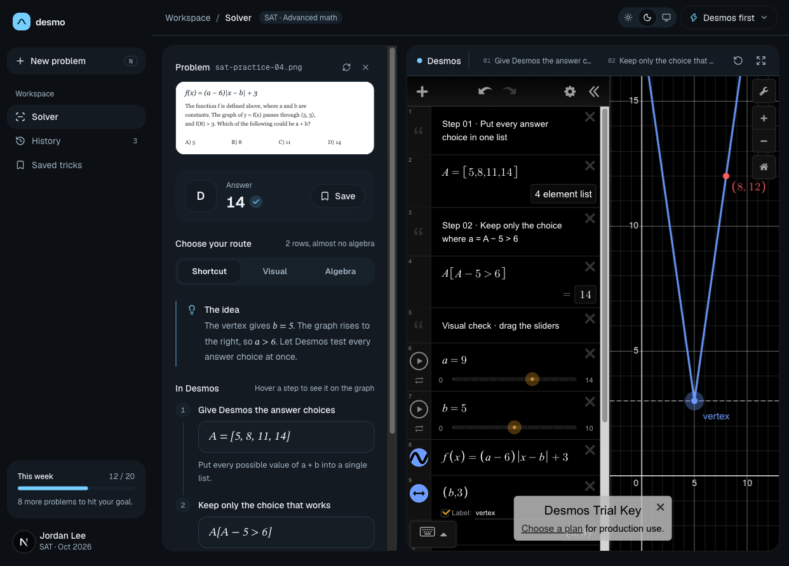 | 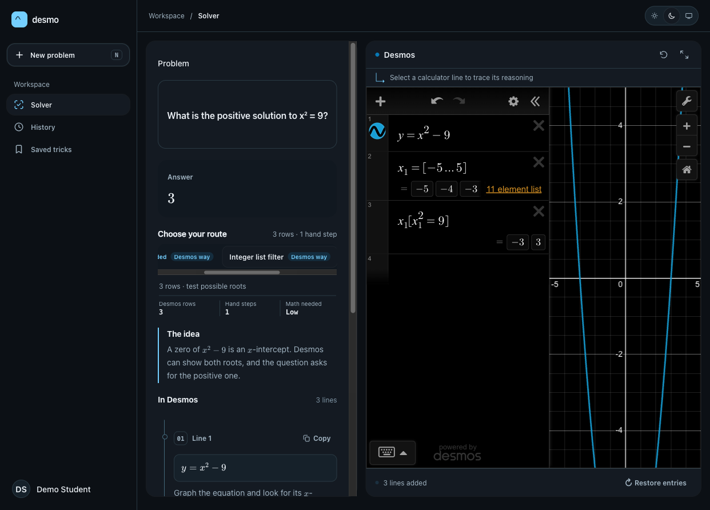 |
| Mobile, light, solved | 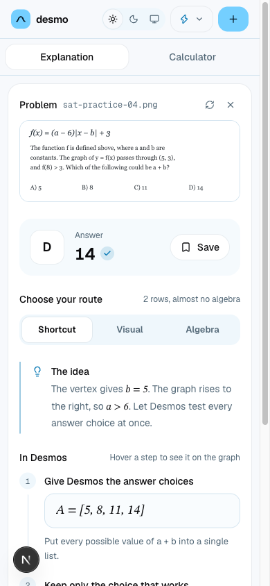 | See mobile empty comparison above; the mobile explanation panel uses the same live components. |
| Mobile, dark, solved | 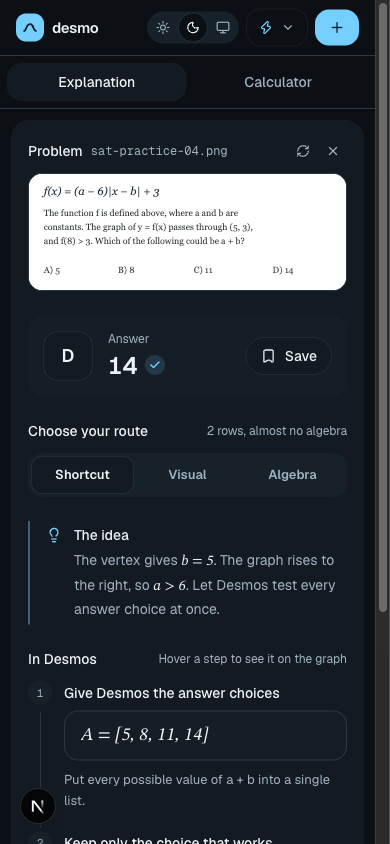 | 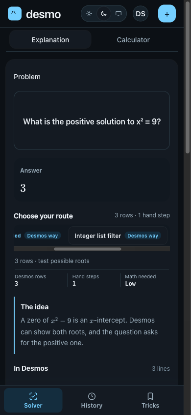 |

The final mobile checks cover the calculator panel, its full-screen overlay, and the profile menu:

- 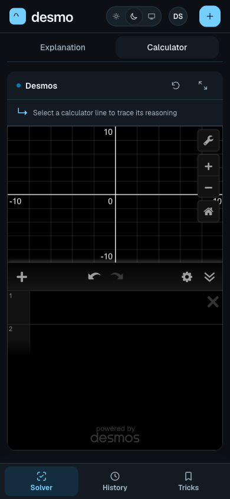
- 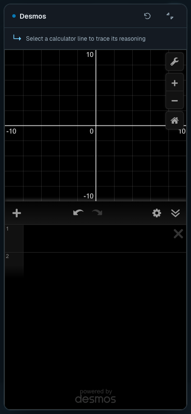
- 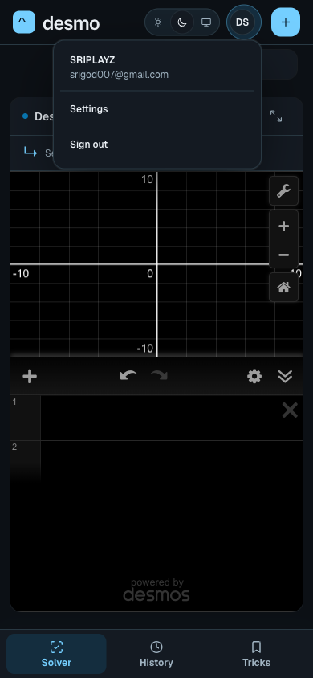

Screenshot-only identity masking replaced the local account name and avatar with “Demo Student” and initials. The source’s weekly-goal panel and “Desmos first” switch are prototype-only; the destination keeps its real navigation, account, and calculator behavior. The source trial-key notice is absent from the destination because it uses the app’s configured Desmos key.
